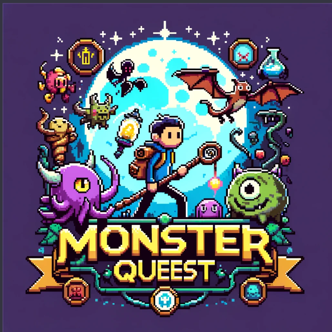

# MonsterQueest v1.0.0

<div style="max-width: 600px; margin: 0 auto;">
 <p align="center"> 
 
</p>

</p>
    <p align="center">This code should be reviewed listening street fighter theme 👨‍💻🎮</p>
    <p align="center">
        <a href="https://www.youtube.com/watch?v=FEdbR0jnfvQ" target="_blank">
           Super Street Fighter II OST Guile Theme🧙‍♂️🐉
        </a>
    </p>
</div>


### Monster Queest is a Node.js backend app built with NestJS and MongoDB. It's designed for gamers and explorers, allowing you to keep track of all the mystical creatures you find in your digital adventures. With Monster Quest, you can easily add, view, update, and delete entries for each creature you come across, detailing their names, titles, descriptions, and more. Plus, there's a fun gold balance feature to see which creatures are favorites. Whether you're cataloging your finds or checking out the community's top picks, Monster Queest makes your creature collection journey exciting and straightforward. 🐉✨ ###

# Requirements to run it locally:

* [Redis](https://redis.io/docs/getting-started/)
* [NodeJS](https://nodejs.org/en/download "NodeJS")
* [Typescript](https://www.npmjs.com/package/typescript)
* [GraphQL](https://graphql.org/graphql-js/)
* [MongoDB](https://www.mongodb.com/docs/manual/installation/)
* [Mongoose](https://www.npmjs.com/package/mongoose)
* [Nest.js Framework](https://docs.nestjs.com/first-steps)


## Before start, to use the project locally install Redis for your specific OS system and make sure is running:

```sh
https://redis.io/docs/getting-started/installation/
```
After this, for linux subsystem for windows:
```sh
sudo service redis-server start
```
* *Redis should respond: `Starting redis-server: redis-server` after setting your password*.

Once the local server is started on  (localhost:defaultPort) use:
```sh
redis-cli
```
* *You should see in the console the host and the port: `127.0.0.1:6379>`*

# Installation instructions:

## Check at the code documentation here to see the whole setup:

<p>
  <a href="" target="_blank">
   Link to code documentation
  </a>
</p>

## Step 1:

## Install all packages through npm.
```sh
npm install
```

## Step 2:

## Run development server to watch logs in the console.
```sh
npm run dev
```

OR

## Run prod server .
```sh
npm run start
```

## To test the solution:

## Run Jest:
```sh
npm run test
```